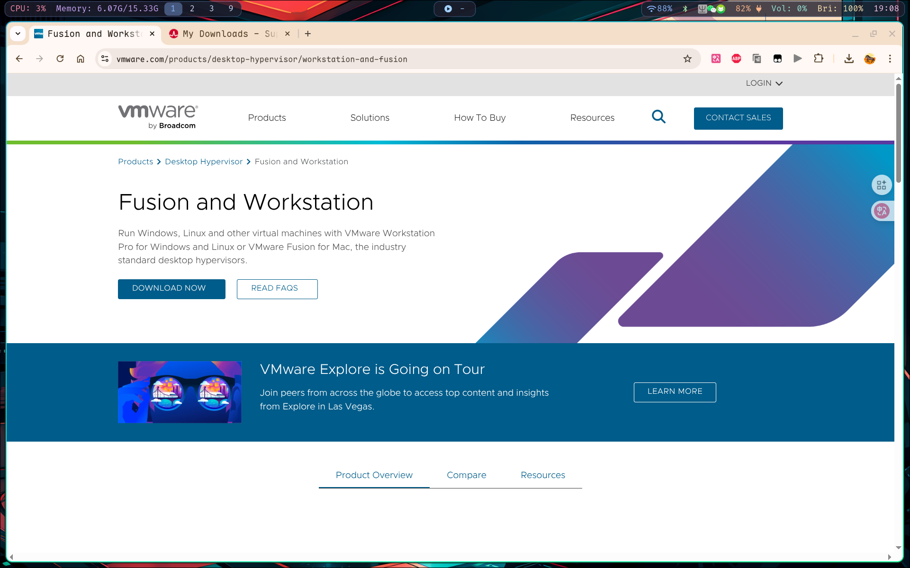
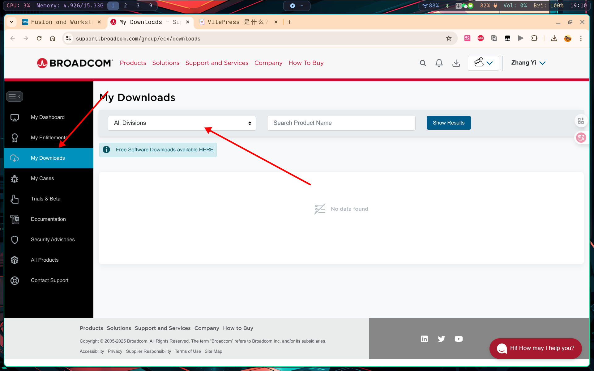
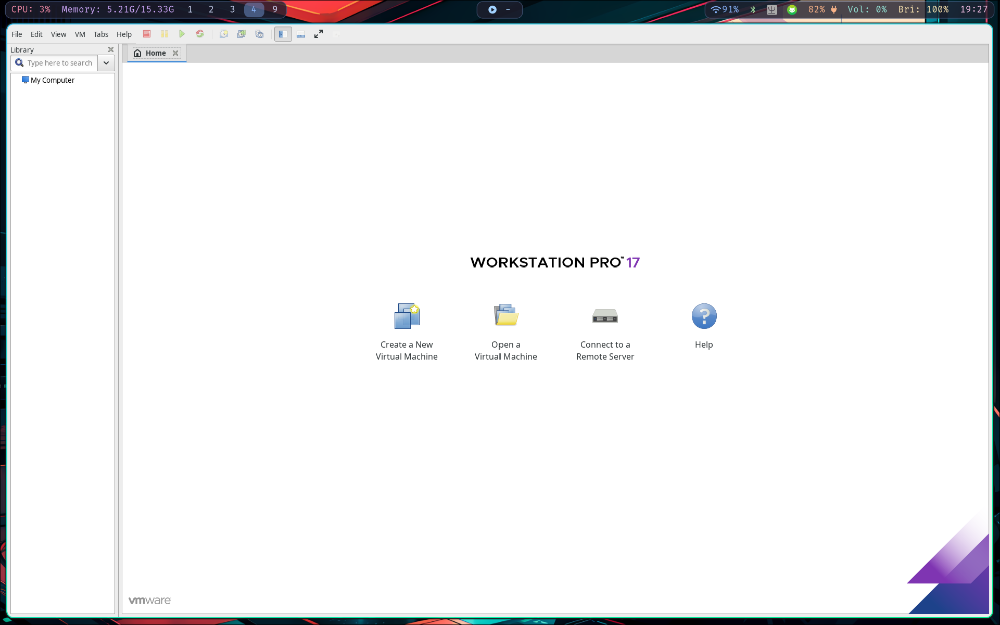

本周心血来潮打算看看Linux下的VMware是什么样子的，于是立马下载安装 VMware Workstation Pro 来看看。结果发现在我这个 6.16 内核的 Fedora 42 上直接翻车了，记录一下折腾过程。

## 为什么新内核会有问题？

简单说就是 VMware 这种闭源软件更新太慢，跟不上 Linux 内核的更新速度。VMware 需要在内核里加载一些模块（vmmon、vmnet这些），但是 Linux 内核的 API 经常变化，VMware 官方的模块就编译不了了。

这种问题在用一些比较激进的发行版（比如 Arch、Fedora 最新版）的时候特别常见，因为内核版本总是很新。不过好在开源社区有大佬维护补丁，能解决这个问题。

## 下载 VMware

现在 VMware 虽然免费了，但是其下载链接还是一如既往的难找。博通收购了 VMware 之后，整个下载流程变得更复杂了。

我先是进入 [VMware 官网](https://www.vmware.com/products/desktop-hypervisor/workstation-and-fusion)，点击 Download，然后就跳到了博通的网站，并且要求注册登录。



**这里有个坑**：注意这个注册的邮箱很多似乎都不能收到验证码，不知道为什么（Gmail, 163 都试过了），我最后是用的 Edu 邮箱才收到验证码。

进入博通这个主页后找到 My Downloads，然后点击这个 Free Downloads：



之后再在这个 All Divisions 下选中 VMware，然后搜索 VMware Workstation Pro 就行了。

如果后续发现下载按钮点击不了，很可能是没有看他要求阅读的那个用户手册啥的，记得先看一下。

也许这个链接能直接打开下载页面：[直接链接](https://support.broadcom.com/group/ecx/productfiles?subFamily=VMware%20Workstation%20Pro&displayGroup=VMware%20Workstation%20Pro%2017.0%20for%20Linux&release=17.6.4&os=&servicePk=533273&language=EN&freeDownloads=true)（不过可能会失效）

## 安装过程 🗿️

下载完成后会是一个 `.bundle` 后缀的文件，是一个可执行文件，这个文件会尝试自动构建所需的内核模块。

```bash
cd ~/Downloads
chmod +x VMware-Workstation-Full-17.6.4-xxxxxx.x86_64.bundle
sudo ./VMware-Workstation-Full-17.6.4-xxxxxx.x86_64.bundle
```

安装完后启动 vmware：

```bash
vmware
```

如果你的内核版本比较老（比如 Ubuntu LTS 什么的），可能到这里就成功了，VMware 会显示一个窗口提示需要安装某些模块在 kernel，点击安装就行。

**但是如果你像我一样用的是 6.16+ 或者其他很新的内核版本，多半会显示安装失败。**

## 新内核的问题和解决方案

如果系统的内核版本和 VMware 提供的模块不兼容，安装过程中就会失败。这时候，就只能选择自己编译 VMware 的内核模块来替代默认的构建过程。

好在 GitHub 上有大佬维护兼容补丁，我们可以直接用。

### 使用社区补丁（推荐方法）

原仓库是 https://github.com/mkubecek/vmware-host-modules，但是由于还没有更新最新版本的 VMware 和内核，所以选择其他人 Fork 的最新版本。

```bash
# 下载兼容补丁
wget https://github.com/aurelihein/vmware-host-modules/archive/workstation-17.6.4.tar.gz

# 解压补丁文件
tar -xzf workstation-17.6.4.tar.gz
cd vmware-host-modules-workstation-17.6.4

# 编译并安装模块
make
sudo make install
```

**注意：如果 make 的时候报错，可能是缺少编译工具**

```bash
# Fedora/RHEL 系列
sudo dnf install kernel-devel kernel-headers gcc make

# Debian/Ubuntu 系列  
sudo apt install linux-headers-$(uname -r) build-essential
```

### 验证安装

执行完上面的步骤后，重新启动 VMware：

```bash
vmware
```

应该会成功进入引导页面了。如果还是不行，可以重新执行一次安装程序，再执行上述补丁步骤。

也可以手动检查一下模块有没有加载成功：

```bash
# 检查内核模块
lsmod | grep vm

# 检查 VMware 服务状态
sudo systemctl status vmware
```

成功的话应该能看到类似这样的界面：



It Works！

## 常见问题和解决方法

### Secure Boot 的问题

如果你的系统开启了 Secure Boot，可能会阻止第三方内核模块加载。有两个解决方法：

1. **简单粗暴**：在 BIOS 里直接关掉 Secure Boot
2. **正经方法**：给模块签名（但比较麻烦，需要自己生成证书什么的）

大部分人直接选择方法1就行了。

### 编译失败的问题

如果在 `make` 的时候报错，通常是缺少必要的编译工具：

```bash
# 检查是否安装了必要的编译工具
sudo dnf install kernel-devel kernel-headers gcc make  # Fedora/RHEL
sudo apt install linux-headers-$(uname -r) build-essential  # Debian/Ubuntu
```

还要确保内核版本匹配：

```bash
uname -r
ls /lib/modules/$(uname -r)/build
```

如果 `/lib/modules/$(uname -r)/build` 这个目录不存在，说明没有安装对应版本的内核头文件。

### 装完了还是启动不了

如果补丁安装成功但 VMware 还是报错，可以试试：

```bash
# 手动加载模块
sudo modprobe vmmon
sudo modprobe vmnet

# 重启 VMware 服务
sudo systemctl restart vmware

# 或者重新运行安装程序
sudo ./VMware-Workstation-Full-17.6.4-xxxxxx.x86_64.bundle --console
```

## 如果还是不行怎么办？

如果 VMware 实在装不上，也不是没有其他选择。我个人觉得这几个替代方案也挺好用的：

### KVM + virt-manager（推荐）

这是 Linux 原生的虚拟化方案，兼容性最好：

```bash
# Fedora
sudo dnf install @virtualization

# Ubuntu  
sudo apt install qemu-kvm libvirt-daemon-system virt-manager
```

优点是性能好，兼容性强，缺点是界面没有 VMware 那么友好。

### VirtualBox

Oracle 家的免费虚拟化软件，跨平台支持很好：

```bash
sudo apt install virtualbox  # 大部分发行版都有
```

界面比 KVM 友好，但性能比 VMware 差一点。

### 容器化方案

如果你只是想跑一些 Linux 发行版或者测试环境，Docker/Podman 可能更适合：

```bash
sudo dnf install podman  # Fedora 推荐用 podman
sudo apt install docker.io  # Ubuntu
```

启动速度快，资源占用少，但不是完整的虚拟机。

## 我的测试环境

这次折腾是在我的笔记本上进行的，配置如下：

```bash
❯ uname -a
Linux fedora 6.16.7-200.fc42.x86_64 #1 SMP PREEMPT_DYNAMIC Thu Sep 11 17:46:54 UTC 2025 x86_64 GNU/Linux

❯ cat /etc/os-release
NAME="Fedora Linux"
VERSION="42 (KDE Plasma Desktop Edition)"
RELEASE_TYPE=stable
ID=fedora
VERSION_ID=42
VERSION_CODENAME=""
PLATFORM_ID="platform:f42"
PRETTY_NAME="Fedora Linux 42 (KDE Plasma Desktop Edition)"
ANSI_COLOR="0;38;2;60;110;180"
LOGO=fedora-logo-icon
CPE_NAME="cpe:/o:fedoraproject:fedora:42"
DEFAULT_HOSTNAME="fedora"
HOME_URL="https://fedoraproject.org/"
DOCUMENTATION_URL="https://docs.fedoraproject.org/en-US/fedora/f42/"
SUPPORT_URL="https://ask.fedoraproject.org/"
BUG_REPORT_URL="https://bugzilla.redhat.com/"
REDHAT_BUGZILLA_PRODUCT="Fedora"
REDHAT_BUGZILLA_PRODUCT_VERSION=42
REDHAT_SUPPORT_PRODUCT="Fedora"
REDHAT_SUPPORT_PRODUCT_VERSION=42
SUPPORT_END=2026-05-13
VARIANT="KDE Plasma Desktop Edition"
VARIANT_ID=kde

❯ vmware --version
VMware Workstation 17.6.4 build-24832109

❯ fastfetch  
             .',;::::;,'.                 yiki21@fedora
         .';:cccccccccccc:;,.             -------------
      .;cccccccccccccccccccccc;.          OS: Fedora Linux 42 (KDE Plasma Desktop Edition) x86_64
    .:cccccccccccccccccccccccccc:.        Host: MDG-XX (M1010)
  .;ccccccccccccc;.:dddl:.;ccccccc;.      Kernel: Linux 6.16.7-200.fc42.x86_64
 .:ccccccccccccc;OWMKOOXMWd;ccccccc:.     Uptime: 1 day, 40 mins
.:ccccccccccccc;KMMc;cc;xMMc;ccccccc:.    Packages: 3600 (rpm), 21 (flatpak), 2 (brew)
,cccccccccccccc;MMM.;cc;;WW:;cccccccc,    Shell: zsh 5.9
:cccccccccccccc;MMM.;cccccccccccccccc:    Display (BOE0B55): 1920x1200 @ 60 Hz (as 1601x1001) in 14" [Built-in]
:ccccccc;oxOOOo;MMM000k.;cccccccccccc:    WM: Hyprland 0.51.0 (Wayland)
cccccc;0MMKxdd:;MMMkddc.;cccccccccccc;    Theme: Adwaita [GTK2]
ccccc;XMO';cccc;MMM.;cccccccccccccccc'    Icons: Papirus [GTK2]
ccccc;MMo;ccccc;MMW.;ccccccccccccccc;     Font: Cantarell (11pt) [GTK2]
ccccc;0MNc.ccc.xMMd;ccccccccccccccc;      Cursor: Bibata-Modern-Ice (24px)
cccccc;dNMWXXXWM0:;cccccccccccccc:,       Terminal: kitty 0.42.2
cccccccc;.:odl:.;cccccccccccccc:,.        Terminal Font: MapleMono-NF-CN-Regular (14pt)
ccccccccccccccccccccccccccccc:'.          CPU: 13th Gen Intel(R) Core(TM) i5-1340P (16) @ 4.60 GHz
:ccccccccccccccccccccccc:;,..             GPU: Intel Iris Xe Graphics @ 1.45 GHz [Integrated]
 ':cccccccccccccccc::;,.                  Memory: 5.50 GiB / 15.33 GiB (36%)
                                          Swap: 1016.93 MiB / 8.00 GiB (12%)
                                          Disk (/): 134.38 GiB / 475.35 GiB (28%) - btrfs
                                          Local IP (wlp0s20f3): 10.194.212.150/16
                                          Battery (HB4692Z9ECW-22T): 83% [AC Connected]
                                          Locale: C.UTF-8
```

## 总结

在最新的 Linux 内核下装 VMware 确实比较折腾，但是用社区的补丁基本都能解决。主要步骤就是：

1. 先尝试正常安装
2. 如果内核模块编译失败，就用 GitHub 上的兼容补丁
3. 注意安装必要的编译工具
4. 如果有 Secure Boot，可能需要关掉

如果实在不行，KVM 或者 VirtualBox 也是不错的选择。对于日常使用来说，这些开源方案其实也够用了，而且更新及时，兼容性更好。

不过话说回来，VMware 的用户体验确实还是很不错的，特别是对新手比较友好。希望博通收购后能更积极地维护 Linux 版本的兼容性吧。

## 参考链接

- [VMware 内核模块补丁（推荐）](https://github.com/aurelihein/vmware-host-modules)
- [原始内核模块仓库](https://github.com/mkubecek/vmware-host-modules)