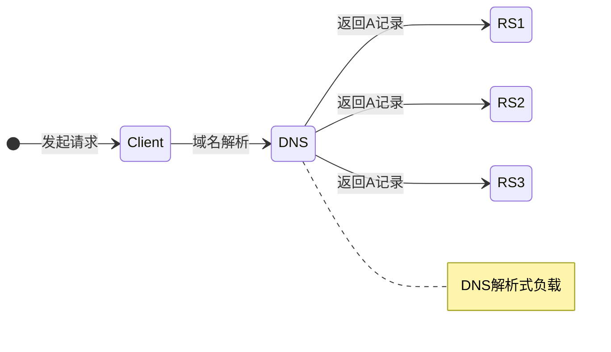
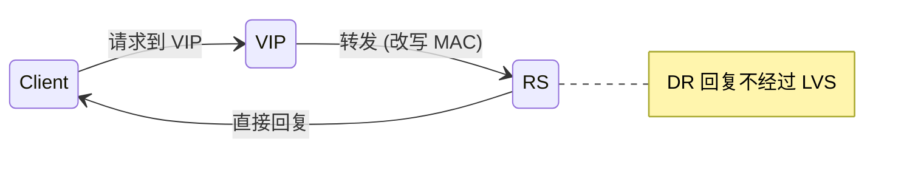
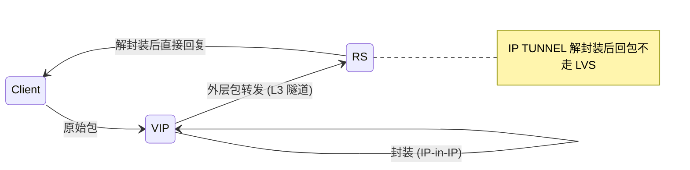
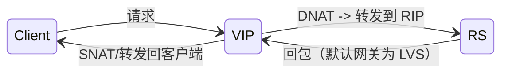
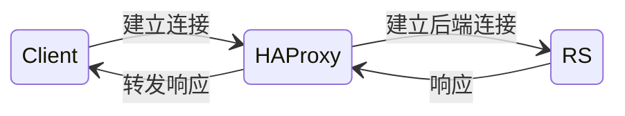
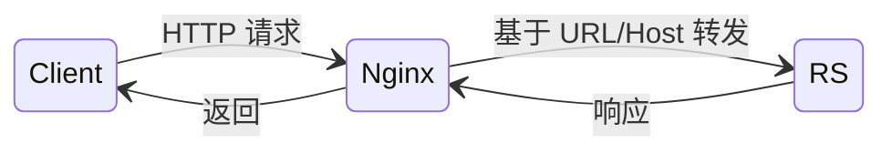

## 负载均衡的原因
- 如果只靠单台服务器来运行服务, 那么如果业务量大一定会撑不住的
- 可以采用DNS解析, 将多个服务器用DNS解析到同一个域名, 但是这样会有这些缺点
    1. Server不可用了DNS发现不了
    2. 这个方式的拓展性太弱, 不可能一个DNS 解析出上千服务器
    3. 不同的机器硬件配置不一样, 这种 DNS 来分发应该所有机器的权重都是一样的
    4. 如果要往入口处新增逻辑, 那所有服务器都得增加, 并且生效时间不可控



## 基于硬件的负载均衡

啥都好就是贵。

稳定性高、硬件加速能力强、功能丰富（健康检查、会话保持等），但采购和维护成本高，通常用于流量很大的生产环境。

常见产品：F5、A10、Citrix ADC、Radware

## 基于软件的负载均衡

### LVS(Linux Virtual Server)
DNS解析到这些LVS服务器的IP上
这种方式主要就是通过转发的方式, 利用Linux的Netfilter实现的四层(IP)转发服务, 将这些请求包转发到不同的服务器上, 其中会更改这些请求包的某些数据
根据转发方式的区别, 分成这三种

注: 为了便于表述，使用缩写：`VIP` = LVS 的虚拟 IP（LVS IP），`RS` = Real Server（真实服务器），`RIP` = RS 的 IP（RealServer IP）。

#### 1. DR模式
用户发送的请求包目标是 `VIP`，LVS 会把该包的目的 MAC 改为目标 `RS` 的 MAC（同时把 Source MAC 设置为 LVS 的 MAC），然后在二层将包发给 `RS`。
因为是通过改写 MAC 实现转发，LVS 与 `RS` 必须在同一 VLAN / L2 广播域。
`RS` 处理后直接将响应发回客户端，响应包无需回到 LVS，因此响应延迟更低。



**特点:**
1. 这个应该是最快的, 因为使用 L2 转发，回复的包不需要经过 LVS
2. 不能跨 VLAN: LVS 通过 MAC 重写转发，依赖 L2 可达性，要求 LVS 和 `RS` 在同一 L2 域

#### 2. IP TUNNEL 模式(IP in IP)
将客户端请求的 IP 包再封装一层外层 IP（IP-in-IP）。经过 LVS 后，外层报文的源/目的 IP 会是 `VIP`（作为外层源）和目标 `RIP`（作为外层目的），因此可以在 L3 网络中转发到任意 `RS`。



因为外层改变了路由信息，L3 隧道允许跨 VLAN / 跨机房转发；响应包同样可以由 `RS` 直接发回客户端（源仍为客户端，目的仍为 `VIP`），因此回包不经过 LVS。

**特点：**
1. IP in IP 封装比较复杂
2. 性能依然高，回包不走 LVS
3. 不需要同 VLAN，因为是 L3 隧道

#### 3. NAT模式
Client 发包到 `VIP`，LVS 使用 DNAT 将目的 IP 改为某个 `RIP`，然后转发给对应的 `RS`。因为 `RS` 看到包的目标地址已被改成 `RIP`，通常需要将默认网关指向 LVS（否则回包可能走错路）。




**特点：**
1. 结构简单，但性能相对较低（响应也要经过 LVS）
2. `RS` 默认网关通常需要指向 LVS，否则回包会偏离

#### 4. SNAT 模式 
和 NAT 类似，但 LVS 会把请求包的源 IP 改为 `VIP`（或 LVS 的出口 IP），使 `RS` 无需把默认网关改为 LVS，回包可以直接路由回 LVS/公网。


### HAProxy
这个和 LVS 不同，HAProxy 基于连接代理（L4/L7 可选），客户与 HAProxy 建立连接，HAProxy 再与目标 `RS` 建立连接并转发请求与响应。



### Nginx
Nginx 与 HAProxy 都是基于代理连接的，Nginx 常作为七层（HTTP）代理/反向代理，可以基于域名、URL、Header 等做路由和负载策略。由于工作在应用层，会有额外的拆包和装包开销，但能做更精细的流量控制。



### 业界的通常实践
> 拿F5/LVS NAT做入口负载均衡，然后再挂一层nginx 做具有业务属性的负载均衡，然后然后内网中使用LVS DR或者NAT或者HAProxy再针对服务集群单独做负载均衡

上面那个是直接摘抄的
我的理解是, 上面那个应该像是传统的负载均衡模式
```
[外部] → F5/LVS NAT → Nginx(业务层LB) → 内网 LVS/HAProxy → 后端服务集群
```
在K8s集群的环境下, 可以先用LVS的方式, 将请求负载均衡到K8S集群的的Ingress Nginx或者类似的服务上
然后Ingress/Gateway 再通过域名等路由方式, 将请求负载均衡到不同的Service
不同的Service能自己负载均衡, 发到不同的Pod上
```
[外部] → (可选) Bare metal LB / Cloud LB → Ingress / Gateway → Service → Pod
```
分别对应:
- 外部 LB = F5/LVS/云 load balancer
- Ingress = L7 路由
- Service = 内网 L4 LB
- Pod = 实例


### 参考文章
- [一文熟知网络 - 文章巨长，但是很详细](https://zhuanlan.zhihu.com/p/642241399)