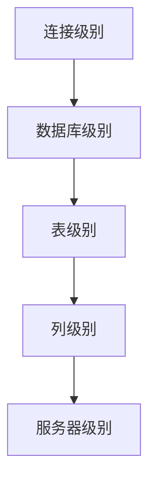

## 概述

在将单体 Spring 应用拆分为微服务并部署到 Kubernetes 集群的过程中，MySQL 数据库的字符集配置往往会成为一个容易被忽视但影响重大的问题。本文将详细介绍在 K8s 环境中部署 MySQL 时遇到的字符集乱码问题，以及完整的解决方案和最佳实践。

## 环境信息

- **Kubernetes**: v1.34
- **MySQL**: 8.0
- **MySQL Connector**: mysql-connector-j (Spring Boot 默认)
- **部署方式**: StatefulSet + ConfigMap

```xml
<dependency>
    <groupId>com.mysql</groupId>
    <artifactId>mysql-connector-j</artifactId>
    <scope>runtime</scope>
</dependency>
```

## 问题现象

### 症状描述

在使用 ConfigMap 挂载 `init.sql` 文件初始化 MySQL 数据库后，发现数据库中的中文数据显示为乱码。

### 初始配置

最初使用的 ConfigMap 配置：

```yaml
kind: ConfigMap
apiVersion: v1
metadata:
  name: mysql-init-config
  namespace: default
data:
  init.sql: |
    # 这里包含导出的SQL语句（已去除注释）
```

### 字符集检查结果

通过 `SHOW VARIABLES LIKE 'character%'` 命令检查发现：

```sql
+--------------------------+--------------------------------+
| Variable_name            | Value                          |
+--------------------------+--------------------------------+
| character_set_client     | utf8mb3                        |
| character_set_connection | latin1                         |
| character_set_database   | utf8mb3                        |
| character_set_filesystem | binary                         |
| character_set_results    | latin1                         |
| character_set_server     | utf8mb3                        |
| character_set_system     | utf8mb3                        |
| character_sets_dir       | /usr/share/mysql-8.0/charsets/ |
+--------------------------+--------------------------------+
```

**问题分析**：可以看到 `character_set_connection` 和 `character_set_results` 仍然是 `latin1`，这是导致乱码的根本原因。

## 解决方案演进

### 尝试 1：SQL 级别字符集设置

在 `init.sql` 中明确指定字符集：

```sql
CREATE TABLE `users` (
  `id` binary(16) NOT NULL,
  `username` varchar(50) NOT NULL,
  `password` varchar(255) NOT NULL,
  `id_card` varchar(20) DEFAULT NULL,
  `phone` varchar(20) DEFAULT NULL,
  `email` varchar(100) NOT NULL,
  `created_at` timestamp NULL DEFAULT CURRENT_TIMESTAMP,
  `del` tinyint(1) DEFAULT '0',
  `avatar_url` varchar(255) DEFAULT NULL COMMENT '用户头像',
  PRIMARY KEY (`id`),
  UNIQUE KEY `username` (`username`),
  UNIQUE KEY `email` (`email`)
) ENGINE=InnoDB DEFAULT CHARSET=utf8mb4 COLLATE=utf8mb4_0900_ai_ci COMMENT='用户表';
```

**结果**：问题依然存在

### 尝试 2：应用层连接字符串配置

修改 Spring Boot 数据源配置：

```properties
spring.datasource.url=jdbc:mysql://mysql:3306/mydb?useUnicode=true&characterEncoding=UTF-8&serverTimezone=Asia/Shanghai&useSSL=false
```

**结果**：问题依然存在

### 尝试 3：StatefulSet 容器参数配置

在 StatefulSet 中通过 `args` 设置 MySQL 字符集参数：

```yaml
apiVersion: apps/v1
kind: StatefulSet
metadata:
  name: mysql
  labels:
    app: mysql
spec:
  serviceName: mysql
  replicas: 1
  selector:
    matchLabels:
      app: mysql
  template:
    metadata:
      labels:
        app: mysql
    spec:
      containers:
        - name: mysql
          image: mysql:8.0
          ports:
            - containerPort: 3306
              name: mysql
          env:
            - name: MYSQL_ROOT_PASSWORD
              valueFrom:
                secretKeyRef:
                  name: swifttravel-secrets
                  key: MYSQL_ROOT_PASSWORD
            - name: MYSQL_DATABASE
              value: "swift_travel"
          args:
            - "--character-set-server=utf8mb4"
            - "--collation-server=utf8mb4_unicode_ci"
```

**结果**：问题依然存在

### 最终解决方案：MySQL 配置文件

**核心发现**：需要通过 MySQL 配置文件全面设置字符集，而不仅仅是服务器端配置。

创建完整的 MySQL 配置文件：

```yaml
apiVersion: v1
kind: ConfigMap
metadata:
  name: mysql-config
data:
  my.cnf: |
    [mysqld]
    character-set-server=utf8mb4
    collation-server=utf8mb4_unicode_ci
    default-time-zone='+8:00'

    [mysql]
    default-character-set=utf8mb4

    [client]
    default-character-set=utf8mb4
```

将配置文件挂载到 MySQL 容器：

```yaml
apiVersion: apps/v1
kind: StatefulSet
metadata:
  name: mysql
spec:
  serviceName: mysql
  replicas: 1
  selector:
    matchLabels:
      app: mysql
  template:
    metadata:
      labels:
        app: mysql
    spec:
      containers:
        - name: mysql
          image: mysql:8.0
          ports:
            - containerPort: 3306
          volumeMounts:
            - name: mysql-config
              mountPath: /etc/mysql/conf.d
            - name: mysql-init
              mountPath: /docker-entrypoint-initdb.d
            - name: mysql-data
              mountPath: /var/lib/mysql
          env:
            - name: MYSQL_ROOT_PASSWORD
              valueFrom:
                secretKeyRef:
                  name: mysql-secrets
                  key: root-password
            - name: MYSQL_DATABASE
              value: "swift_travel"
      volumes:
        - name: mysql-config
          configMap:
            name: mysql-config
        - name: mysql-init
          configMap:
            name: mysql-init-config
  volumeClaimTemplates:
    - metadata:
        name: mysql-data
      spec:
        accessModes: ["ReadWriteOnce"]
        resources:
          requests:
            storage: 10Gi
```

**验证结果**：

```sql
mysql> SHOW VARIABLES LIKE 'character%';
+--------------------------+--------------------------------+
| Variable_name            | Value                          |
+--------------------------+--------------------------------+
| character_set_client     | utf8mb4                        |
| character_set_connection | utf8mb4                        |
| character_set_database   | utf8mb4                        |
| character_set_filesystem | binary                         |
| character_set_results    | utf8mb4                        |
| character_set_server     | utf8mb4                        |
| character_set_system     | utf8mb3                        |
| character_sets_dir       | /usr/share/mysql-8.0/charsets/ |
+--------------------------+--------------------------------+
```

## 重要发现：init.sql 文件处理

### 问题根源

在问题解决过程中发现，手动编辑 mysqldump 导出的 SQL 文件会带来额外的风险：

1. **字符集设置语句被误删**：mysqldump 导出的文件中包含重要的 `SET` 语句
2. **SQL 执行中断**：删除看似"无用"的语句可能导致初始化脚本执行失败

### 最佳实践

```sql
-- mysqldump 导出的文件通常包含这些重要设置
SET @OLD_CHARACTER_SET_CLIENT=@@CHARACTER_SET_CLIENT;
SET @OLD_CHARACTER_SET_RESULTS=@@CHARACTER_SET_RESULTS;
SET @OLD_COLLATION_CONNECTION=@@COLLATION_CONNECTION;
SET NAMES utf8mb4;
SET @OLD_UNIQUE_CHECKS=@@UNIQUE_CHECKS, UNIQUE_CHECKS=0;
SET @OLD_FOREIGN_KEY_CHECKS=@@FOREIGN_KEY_CHECKS, FOREIGN_KEY_CHECKS=0;
SET @OLD_SQL_MODE=@@SQL_MODE, SQL_MODE='NO_AUTO_VALUE_ON_ZERO';
SET @OLD_TIME_ZONE=@@TIME_ZONE, TIME_ZONE='+00:00';
```

**建议**：直接使用 mysqldump 导出的完整 SQL 文件，避免手动删除任何语句。

### MySQL 8.0 字符集变化

MySQL 8.0 相比之前版本在字符集处理上的重要变化：

1. **默认字符集升级**：从 `latin1` 升级到 `utf8mb4`
2. **排序规则变化**：默认使用 `utf8mb4_0900_ai_ci`
3. **连接字符集处理**：更严格的字符集一致性要求

### 字符集配置层次

MySQL 字符集配置存在多个层次，优先级从高到低：



## 更好的实践建议
其实使用init.sql初始化数据库并不是一个很好的实践, 更好的实践建议是, 使用数据库迁移工具如 Flyway 或 Liquibase，管理数据库版本和变更脚本, 这样可以更好地控制数据库的变更历史和版本, 避免手动编辑SQL文件带来的风险.


## 参考资料

- [MySQL 8.0 Character Set Support](https://dev.mysql.com/doc/refman/8.0/en/charset.html)
- [Docker MySQL 字符集配置指南](https://blog.csdn.net/weixin_45699541/article/details/126174128)
- [MySQL字符集终极指南--进阶篇](https://cloud.tencent.com/developer/article/2312432)
- [Kubernetes StatefulSets Documentation](https://kubernetes.io/docs/concepts/workloads/controllers/statefulset/)
